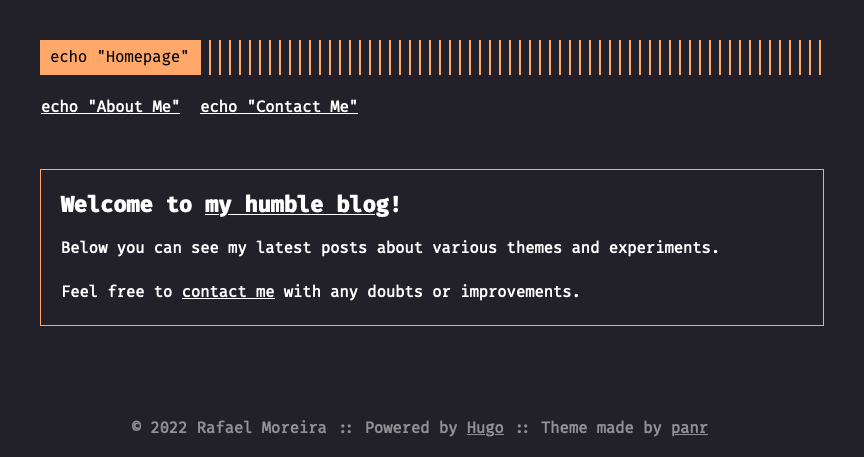

# homelabrafael.com

A fully static, small footprint Website, powered by [Hugo](https://gohugo.io/), deployed with [Cloudflare Workers](https://workers.cloudflare.com/).

[](https://homelabrafael.com)

## Technology Stack

- **Static Site Generator**: Hugo v0.148.1
- **Deployment Platform**: Cloudflare Workers with Static Assets
- **Theme**: [Hugo Coder](https://github.com/luizdepra/hugo-coder)
- **Package Manager**: npm
- **Build Tool**: Wrangler v4.26.0

## Development

### Prerequisites

- Node.js (>= 18.0.0)
- Hugo v0.148.1+ (extended version)
- Wrangler CLI

### Available Scripts

- `npm run build` - Build the Hugo site with minification
- `npm run dev` - Start local development server with Wrangler
- `npm run deploy` - Build and deploy to Cloudflare Workers
- `npm run preview` - Start Hugo development server with drafts
- `npm run clean` - Clean build artifacts

### Local Development

1. Clone the repository
2. Install dependencies: `npm install`
3. Start development server: `npm run dev`
4. Open [http://localhost:8787](http://localhost:8787)

### Deployment

The site is automatically deployed to Cloudflare Workers. For manual deployment:

```bash
npm run deploy
```

## Migration from Cloudflare Pages

This website was successfully migrated from Cloudflare Pages to Cloudflare Workers following the [official migration guide](https://developers.cloudflare.com/workers/static-assets/migration-guides/migrate-from-pages/). Key improvements include:

- Enhanced observability and debugging capabilities
- Access to additional Cloudflare Workers features
- Improved development workflow with Wrangler
- Better control over static asset serving

## Theme

The theme used in this website is the `Hugo Coder` theme, available on [`hugo-coder` GitHub Repository](https://github.com/luizdepra/hugo-coder).

## License

Copyright © 2024 Rafael Moreira

This repository and all it's code is licensed under the [MIT License](./LICENSE).
