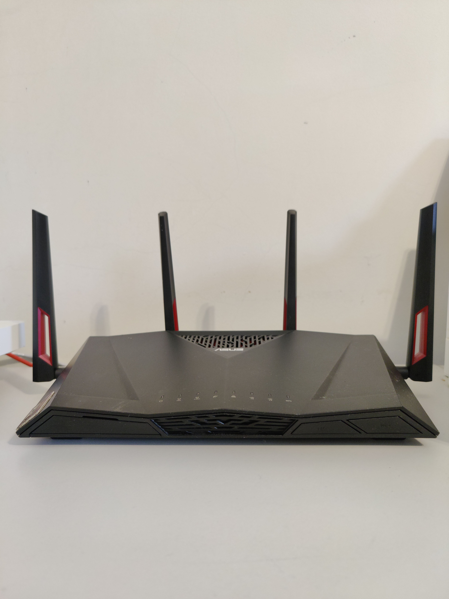
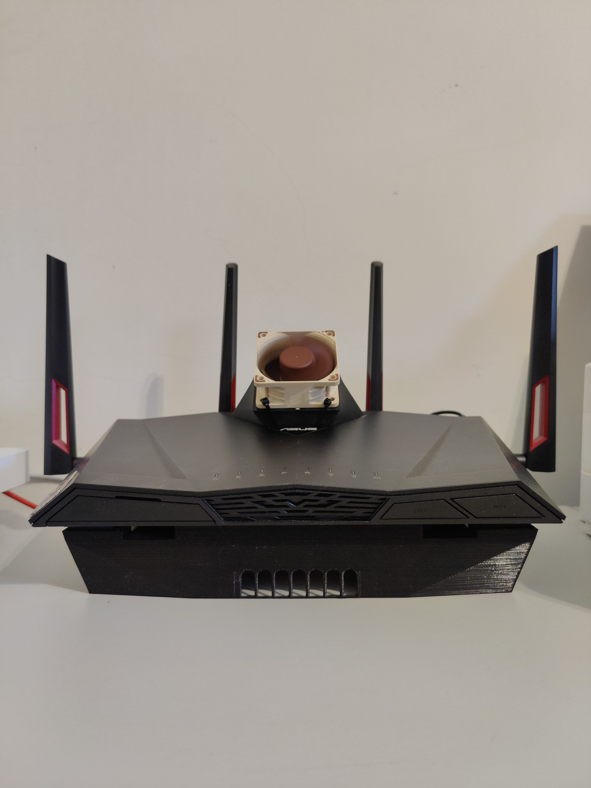
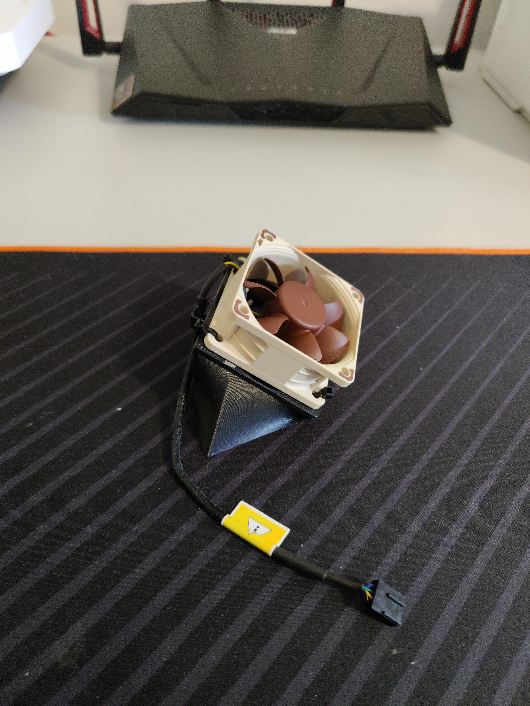
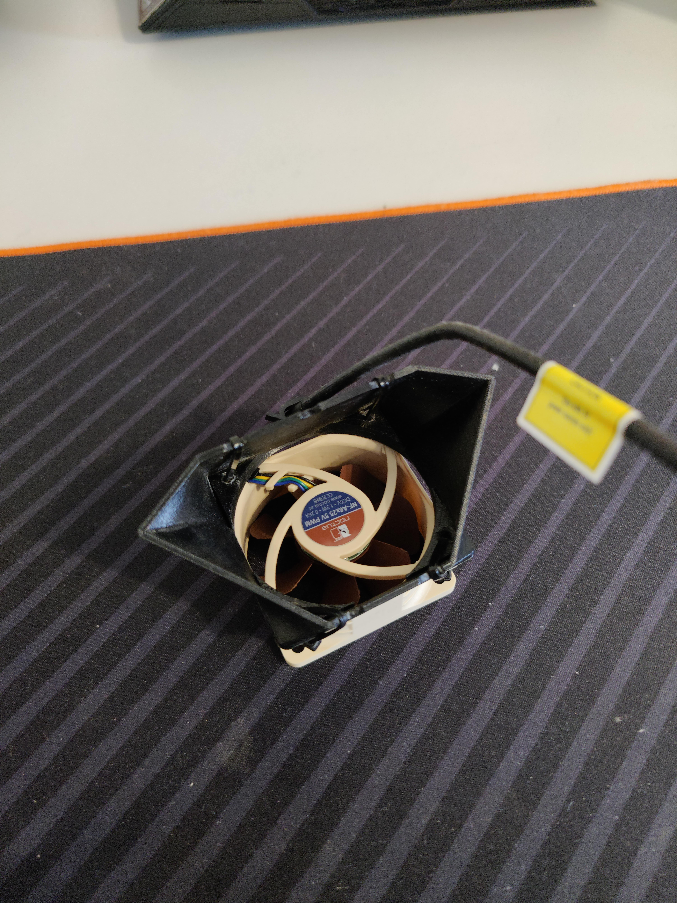
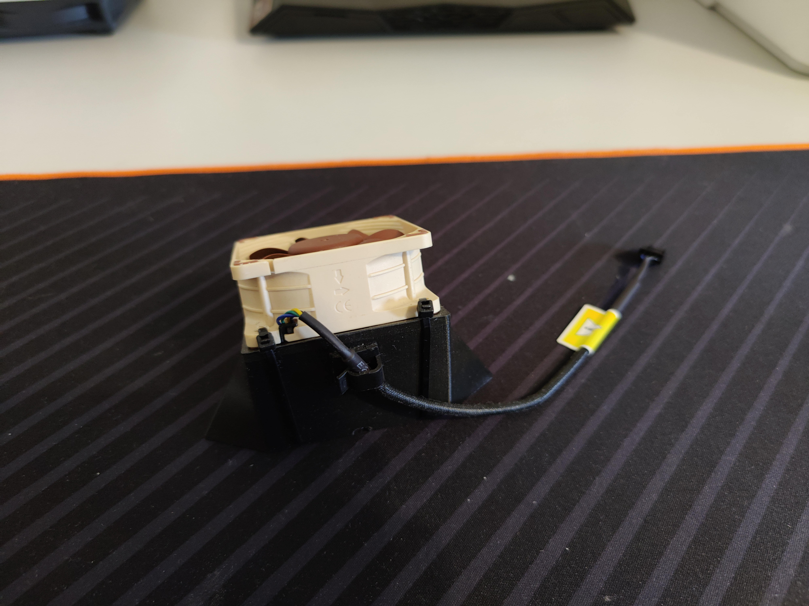
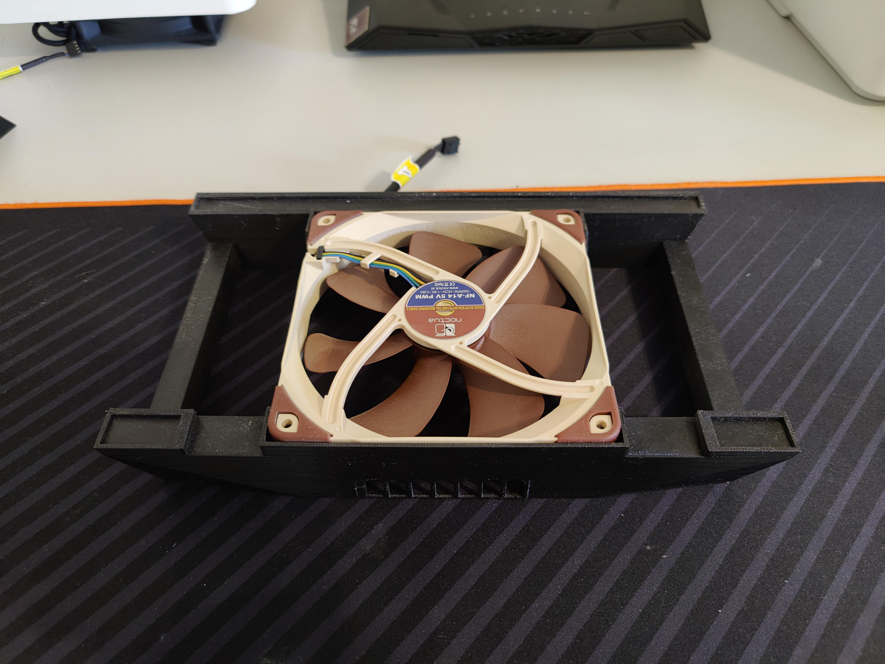
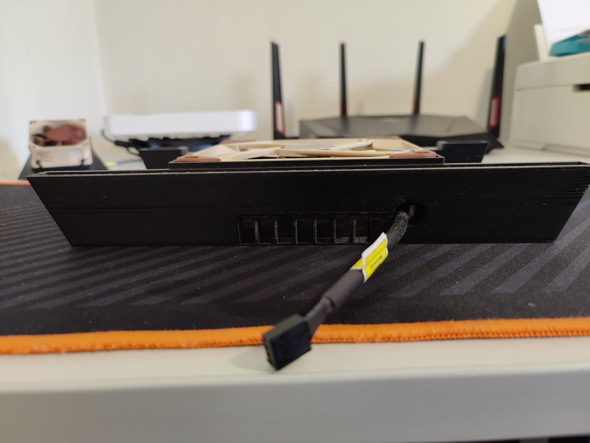
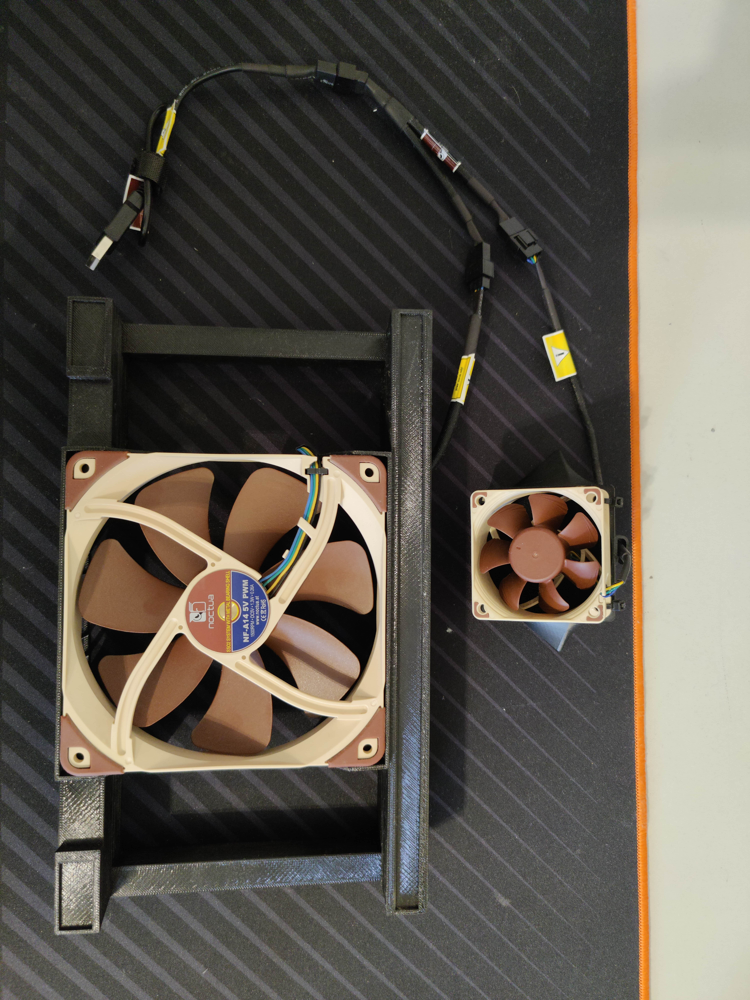
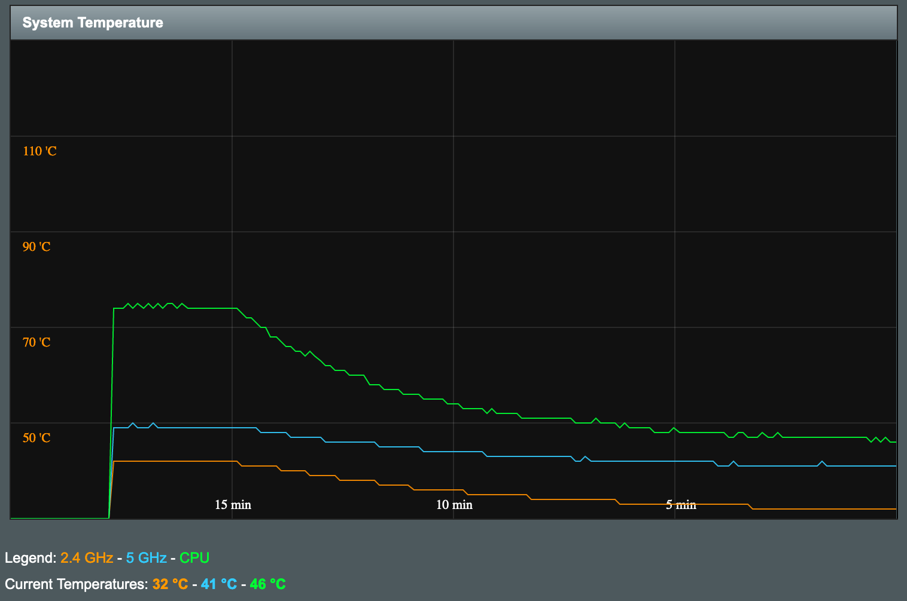

+++
title = "Why do I have one of the coolest (literally) Asus Routers ever?"
date = "2019-08-14"
author = "Rafael Moreira"
cover = "asus.svg"
images = ["posts/asus-router/asus_og.jpg"]
tags = [ "asus", "router", "networking", "hardware" ]
description = "See what modifcations I made to my Asus router to improve it's performance and stabillity."
disableToc = true
+++

Technology is not always about software. Hardware plays a major part in it because it is what runs the world at the end of the day.

At our homes, the normal internet user will have one router provided by their ISEP (internet service provider) and that will suffice it's needs. But I could not settle for that.

My ISP provided me with the [Technicolor TG789VAC V2](https://openwrt.org/inbox/toh/technicolor/tg789vac_v2), a dual core and 256MB sample of a router. It was not enogh for me. When I say _sample of a router_ I do not mean to bash on Technicolor's creation, just the choice of router for my ISP.

I currently have an uplink of 500Mbps of download and 100Mbps of upload and this router has 5 Gigabit ports that should, in theory, be sufficient for normal usage. The problem started when managing devices, configurations or fetching simple information. Here follows a list of problems I had with this router:

- The login took 5 minutes at times, and it even timed-out at some point
- The router could not recognize the same device two times, so two entries would appear for each device on the 'known devices list'
- The router was not able to keep 3 gigabit ports running at full speed and the 5GHz Wi-Fi connection running at decent speeds, the 5 GHz would drop to about 100Mbps
- It clearly overheated since the plastic was hot to the touch, with no way to fetch temperature information

And the list could continue with my experience from almost 3 years with this ISP router. But, at some point, i decided I wanted to invest in something better, that could solve all my problems and have cool features at the same time.

So enters Asus and their networking equipment. There are a lot of major players on the networking industry, some are more data-center focused, other also provide home-networking solutions (like Ubiquiti, that has a perfect balance of offers). I chose Asus because of their reputation, my experience with their devices (mostly laptops) in the past, and the fact that they provide some real powerful routers.

My first choice was the router AC88U, for which you can get the specs [here](https://www.asus.com/pt/Networking-IoT-Servers/WiFi-Routers/ASUS-WiFi-Routers/RT-AC88U/techspec/). I chose this as my main router for the following reasons:

- 8 Gigabit ports, with two individual controllers for each 4 ports (which means that they can all work without hiccups at full speed)
- 512Mb of RAM and 1.4GHz dual-core processor
- 1000Mbps on the 2.4GHz wireless band and 2167Mbps on the 5GHz wireless band
- AiMesh support (this was a requirement rather than a nice to have, more on that later)
- QoS, traffic controll, wepage analysis, amongst other features
- ISP support: Asus works with ISPs to implement their specific protocols, so you can still have your ISP router working as intended for top boxes, for example, and have the network managed by the Asus Equipment

It is not cheap, but looking for promotions I was able to get it 100€ below MSRP, which is a solid investment for the kind of hardware I was buying. I was thinking of expanding my home networking with more routers so I wanted something with [AiMesh](https://www.asus.com/microsite/AiMesh/en/index.html) support.

AiMesh is a feature that allows you to create an Wi-Fi mesh in your house using routers. Traditionally, this is made by using specific Mesh hardware that works together to deliver a smooth Wi-Fi experience, but Asus made sure to include a feature on their routers so you can have more versatillity out of your routers.

After some time I installed an [Asus RT-AX55](https://www.asus.com/pt/Networking-IoT-Servers/WiFi-Routers/All-series/RT-AX55/techspec/) to serve as a Mesh node and network split for the other end of the house, and they are both connected via Gigabit as their backhaul, so they are blazing fast talking to each other. The Wi-Fi mesh system works great, with little to no configuration needed out of the box, so my devices can roam the entire house and not have separate Wi-Fi networks between access points.

Now, after all this setup, I switched the original firmware on my AC88U to the [Asuswrt-Merlin](https://www.asuswrt-merlin.net/). This firmware is based on the original firmware that Asus ships with their routers (and that gets updated frequently, by the way), but adds a [battery of features](https://www.asuswrt-merlin.net/features) on top of it, as well as support for addons.

Included in this firmware is a tool to check the temperature. After sometime checking it, I noticed that the processor easily spiked to 80°C on a hotter day, so I wanted to do something about it. At first, putting a fan on the bottom seemed like the reasonable way to go, but after watching a disassebly video I noticed that there are chips that could use cooling on the top side of the PCB (in fact there is an exhaust vent on the top of the router).

I jumped on Thingiverse and found these two pieces:

- [ASUS AC88U Fan](https://www.thingiverse.com/thing:2826415)
- [Asus RT-AC88u 140mm cooling fan stand](https://www.thingiverse.com/thing:2197533)

In theory, these two 3D printed pieces paired with some decent Noctua fans would deliver the cooling I needed and so I ordered the following fans:

- [NF-A6x25 5V](https://noctua.at/en/products/fan/nf-a6x25-5v)
- [NF-A14 5V](https://noctua.at/en/products/fan/nf-a14-5v)

These are 5V specific fans, there were optimized to work on USB ports, for example, and deliver pressure and airflow like no other on the market, whilst maitaining a decent amount of noise for their performance. There paired perfectly with the 3D Printed parts (that I got from local sellers that printed it at their homes and sold it to me for a fair price, always support local businesses whenever possible). This was the result of this setup:

> **Before**
>
> 

> **After**
>
> 

> **60mm Fan (Top)**
>
> 
>
> 
>
> 

As you can see I had a bit of a problem with the screws for the 60mm Fan. This is because this design (3d printed part) will work better with fans that have an _open corner_ design, so you can insert a screw and tighten it from the top. These fans do not allow it easily, nor did I find screws that fited this design by the time I've put this together. I've done a few cuts using a sharp knife to accomodate the zip-ties and keep the piece leveled until I find suitable screws for this purpose (working from the underside is not very easy also).

> **140mm Fan (Bottom)**
>
> 
>
> 

The fit on the cable management hole for the 140mm fan is not very easy but workable nonetheless.

> **Fan Connections**
>
> 

If you decide to go with this setup, the 140mm fan brings an Y splitter (PWM) and the 60mm fan brings the USB adapter, so you can make this connection and setup work.

Please keep in mind that these fans are not SUPER quiet, they still make some noise. You could install a [NA-FC1](https://noctua.at/en/na-fc1) PWM fan controller and set the speed lower and probably achieve good results. In the future I intend to develop some kind of solution to link the router's thermal probe to the status of the fan. This is currently possible since you can shutdown the data pins for the USB port using the special features of the Asuswrt-Merlin software but you cannot disable the 5V power pins and this will require some more thinkering. An USB hub with power buttons could do the job of turning on and off the fans since it would not require disconnecting the USB plug for the fan (**keep in mind the maximum amperage of the USB port!**).

Now, as for performance and cooling, here are the base readings on a _normal_ day:

|             | **Temperature** |
| :---------: | :-------------: |
| **Ambient** |      22°C       |
|   **CPU**   |      75°C       |
|  **5GHz**   |      50°C       |
| **2.4GHz**  |      42°C       |

And here are the results after just around 15 minutes of both fans turned on:

|             | **Temperature** | **Delta (ΔT)** |
| :---------: | :-------------: | :------------: |
| **Ambient** |      22°C       |      22°C      |
|   **CPU**   |      46°C       |     -29°C      |
|  **5GHz**   |      41°C       |      -9°C      |
| **2.4GHz**  |      32°C       |     -10°C      |

Now that's impressive, with an almost 30°C drop on the CPU, this allows it to run at full speed most of the time. Now, to be clear, there is nothing wrong with the original temperatures, Asus did not include any cooling whatsoever on the router because these temperatures are fine, but on hotter days you may experience 80+°C on the CPU and 60+°C on the 5GHz chip and that can make you feel instabillity on the network.

Given the final results, I would say that this experience was a success, but I still have a few improvements to make:

- Add a PWM controller (because, even though these are 5V fans they are still PWM capable) to the fans so I can tune their speed
- Add a small USB hub to turn off the fans with a single button
- Find a way to link the fans to the temperature of the router to have them dinamically turn on and off (there is a feature to shut-off USB ports but only works for the data pins, not the power pins of the USB)

Conclusion: should you do something like this? Probably no. Was it worth it? Yes.
